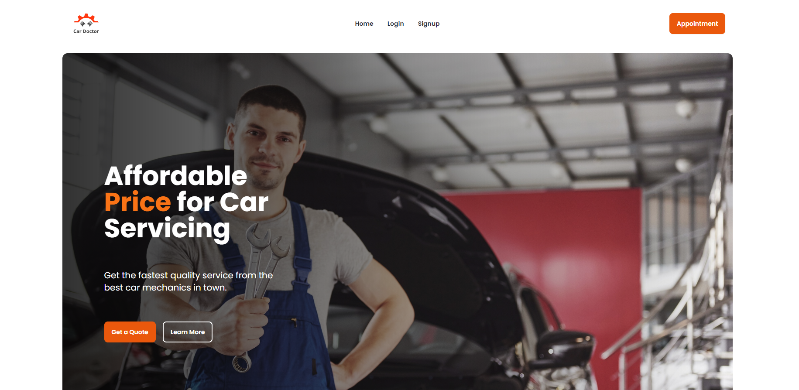

<!-- Table of Contents -->

# :trophy: Genius Car Doctor Project [Genius Car Live Demo](https://genius-car-b5cb3.web.app/)

This is a practice project I am working on learning React, React Router, Firebase Authentication, Pagination, MongoDB, Express, Node, JWT Authorization
=======
# :trophy: Genius Car Doctor Project (Tashrique Ahmed)

A short description about the project. What was the purpose. 


# :notebook_with_decorative_cover: Table of Contents

- [About the Project](#star2-about-the-project)
  - [Tech Stack](#space_invader-tech-stack)
  - [Features](#dart-features)
  - [Environment Variables](#key-environment-variables)
- [Getting Started](#toolbox-getting-started)
  - [Prerequisites](#bangbang-prerequisites)
  - [Run Locally](#running-run-locally)
- [Contributing](#wave-contributing)
- [License](#warning-license)
- [Contact](#handshake-contact)

<!-- About the Project -->

## :star2: About the Project



<!-- TechStack -->

### :space_invader: Tech Stack

<details>
  <summary>Client</summary>
  <ul>
    <li>Javascript</li>
    <li>React.js</li>
    <li>React Router</li>
    <li>TailwindCSS</li>
    <li>Firebase</li>
  </ul>
</details>

<details>
  <summary>Server</summary>
  <ul>
    <li>Javascript</li>
    <li>Express.js</li>
    <li>Node.js</li>
    <li>JWT</li>
    <li>Cors</li>
    <li>Dotenv</li>
  </ul>
</details>

<details>
<summary>Database</summary>
  <ul>
    <li>MongoDB</li>
  </ul>
</details>
<!-- 
<details>
<summary>DevOps</summary>
  <ul>
    <li><a href="https://www.docker.com/">Docker</a></li>
    <li><a href="https://www.jenkins.io/">Jenkins</a></li>
    <li><a href="https://circleci.com/">CircleCLI</a></li>
  </ul>
</details> -->

<!-- Features -->
<!--
### :dart: Features

- Feature 1
- Feature 2

- Feature 3 -->

- Feature 3


<!-- Env Variables -->

### :key: Environment Variables

To run this project, you will need to add the following environment variables to your .env file

```
    Firebase:

    apiKey: import.meta.env.VITE_apiKey,
    authDomain: import.meta.env.VITE_authDomain,
    projectId: import.meta.env.VITE_projectId,
    storageBucket: import.meta.env.VITE_storageBucket,
    messagingSenderId: import.meta.env.VITE_messagingSenderId,
    appId: import.meta.env.VITE_appId
```

<!-- Getting Started -->

## :toolbox: Getting Started

<!-- Prerequisites -->

### :bangbang: Prerequisites

This project uses Vite as package manager

```bash
 npm install --global vite
```

<!-- Installation -->

### :running: Run Locally

Clone the project

```bash
  git clone https://github.com/tashrique/Genius-Car-Driver-Client.git
```

Go to the project directory

```bash
  cd Genius-Car-Driver-Client/
```

Install dependencies

```bash
  npm install
```

Start the server

```bash
  npm run dev
```


<!-- Roadmap -->


<!-- Contributing -->

## :wave: Contributing

Contributions are always welcome!

Feel free to `fork`. Message me at [Linkedin](https://linkedin.com/in/tashrique-ahmed) if you want.

<!-- License -->

## :warning: License


Copyright **Tashrique Ahmed**

Licensed under the Apache License, Version 2.0 (the "License");
you may not use this file except in compliance with the License.
You may obtain a copy of the License at

    http://www.apache.org/licenses/LICENSE-2.0

Unless required by applicable law or agreed to in writing, software
distributed under the License is distributed on an "AS IS" BASIS,
WITHOUT WARRANTIES OR CONDITIONS OF ANY KIND, either express or implied.
See the License for the specific language governing permissions and
limitations under the License.


<!-- Contact -->

## :handshake: Contact

Tashrique Ahmed

<<<<<<< HEAD
- [Linkedin](https://linkedin.com/in/tashrique-ahmed)
- [@tashrique](https://twitter.com/tashrique)
- [tashrique.com](https://www.tashrique.com)


